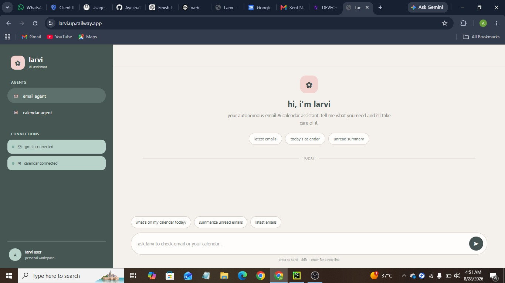
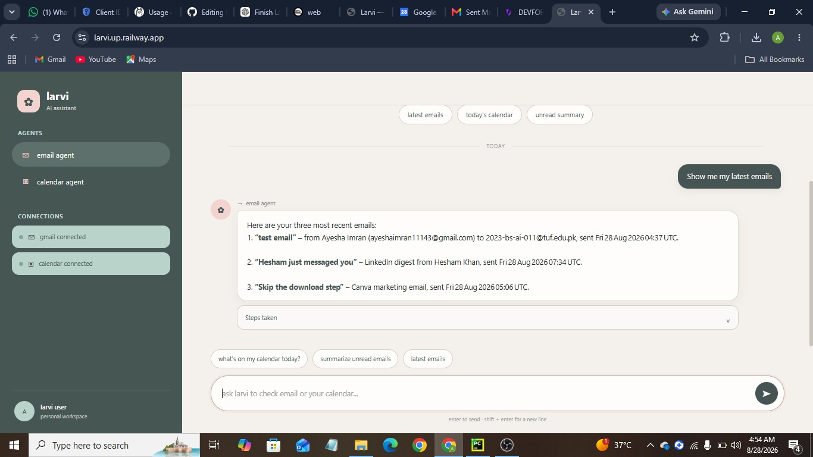

# Larvi — Autonomous Email & Calendar AI Agent

> **Larvi** is an autonomous AI assistant that understands natural-language requests and performs real Email and Calendar operations through Gmail API and Google Calendar API.

Larvi goes beyond a traditional chatbot by understanding user intent, selecting the appropriate agent, calling real tools, interacting with external APIs, maintaining conversation context, and returning verified results.

---

## 📸 Project Screenshots

### Main Chat Interface



Larvi provides a simple conversational interface where users can interact with the Email and Calendar agents using natural-language commands.

### Email Search & Management



Larvi can search, retrieve, read, summarize, draft, send, and reply to emails through the Gmail API.

### Calendar Management


Larvi can view calendar events, check availability, detect scheduling conflicts, and create or manage events through Google Calendar API.

---

# 🎯 Objective

The objective of Larvi is to build an autonomous AI agent capable of managing Email and Calendar tasks using natural-language instructions.

Unlike a normal chatbot, Larvi can:

- Understand the user's objective
- Identify user intent
- Select the appropriate specialized agent
- Select and execute tools
- Interact with real APIs
- Coordinate multiple agents
- Maintain conversation context
- Handle errors
- Ask for confirmation before important actions
- Return verified results

---

# 🤖 System Architecture

```text
                         User
                           │
                           ▼
                    Master Agent
                           │
              ┌────────────┴────────────┐
              ▼                         ▼
        Email Agent              Calendar Agent
              │                         │
              ▼                         ▼
        Email Tools              Calendar Tools
              │                         │
              ▼                         ▼
          Gmail API            Google Calendar API
              │                         │
              └────────────┬────────────┘
                           ▼
                         Result
                           │
                           ▼
                         User
✨ Core Features
📧 Email Management

Larvi can:

Search emails
Read emails
Retrieve recent emails
Search by sender
Search by subject
Search using keywords
Summarize emails
Extract useful information
Create email drafts
Send emails
Reply to emails
Example Requests
Show me my latest emails
Find emails from Ahmed
Find the email about tomorrow's meeting
Summarize my unread emails
Draft a reply to this email
Send Ali an email about the project update
📅 Calendar Management

Larvi can:

View upcoming events
Search calendar events
Check availability
Detect scheduling conflicts
Create events
Update events
Reschedule events
Cancel events
Delete events
Retrieve event details
Example Requests
What meetings do I have tomorrow?
Am I free tomorrow at 4 PM?
Schedule a meeting tomorrow at 3 PM
Move my meeting to 5 PM
Cancel tomorrow's project meeting
🧠 Master Agent

The Master Agent acts as Larvi's central controller.

It is responsible for:

Understanding natural-language instructions
Identifying user intent
Extracting relevant information
Selecting the appropriate specialized agent
Coordinating Email and Calendar agents
Managing workflow state
Maintaining conversation context
Handling failures
Generating the final response

The Master Agent can route requests to:

email_agent
calendar_agent
multi_agent
📧 Email Agent

The Email Agent specializes in Gmail operations.

User Request
     ↓
Master Agent
     ↓
Email Agent
     ↓
Email Tool
     ↓
Gmail API
     ↓
Result
Available Tools
search_emails
read_email
get_recent_emails
create_draft
send_email
reply_email
📅 Calendar Agent

The Calendar Agent specializes in Google Calendar operations.

User Request
     ↓
Master Agent
     ↓
Calendar Agent
     ↓
Calendar Tool
     ↓
Google Calendar API
     ↓
Result
Available Tools
get_events
search_events
check_availability
create_event
update_event
delete_event
🔄 Multi-Agent Workflows

Larvi supports workflows where multiple specialized agents work together.

Workflow 1 — Email → Calendar

Example:

Find the email from Ahmed about the project meeting
and add that meeting to my calendar.

Workflow:

Master Agent
     ↓
Email Agent
     ↓
Search Email
     ↓
Read Email
     ↓
Extract Meeting Information
     ↓
Calendar Agent
     ↓
Check Availability
     ↓
Create Event
     ↓
Final Response
Workflow 2 — Email → Availability → Calendar

Example:

Check whether I received an email from Ali about
tomorrow's project meeting. If you find the meeting
time, check whether I am free and add it to my calendar.

Workflow:

Master Agent
     ↓
Email Agent
     ↓
Search Email
     ↓
Read Email
     ↓
Extract Date & Time
     ↓
Calendar Agent
     ↓
Check Availability
     ↓
Create Event
     ↓
Final Response
🧩 Context-Based Follow-Up

Larvi maintains relevant conversation state so users can give natural follow-up instructions.

Example:

User:
Find my Project Review meeting.
Larvi:
I found the Project Review meeting at 3 PM.
User:
Move it to 5 PM.

Larvi can use the previous conversation context to understand that "it" refers to the previously identified meeting.

🛠️ Tool Calling

Larvi uses actual functions and tools to perform operations.

User Request
     ↓
LLM Reasoning
     ↓
Tool Selection
     ↓
Tool Execution
     ↓
API Result
     ↓
Final Response

Larvi does not claim that an operation was successful unless the corresponding tool or API confirms the result.

🔐 Authentication

Larvi uses Google OAuth 2.0 for Gmail and Google Calendar.

User
  ↓
Connect Google
  ↓
Google OAuth
  ↓
Permission Granted
  ↓
Authorization Code
  ↓
Larvi
  ↓
Google Credentials
  ↓
Gmail / Calendar APIs

Required Google APIs:

Gmail API
Google Calendar API

Sensitive credentials are stored using environment variables and are not hard-coded into the source code.

🛡️ Safety & Confirmation

Larvi includes confirmation handling for important external actions.

Confirmation can be required before actions such as:

Sending emails
Deleting emails
Cancelling meetings
Rescheduling important meetings
Other potentially destructive actions

Example:

User:
Send Ali an email about the project update.

Larvi can prepare the email first:

Draft ready — confirm before sending.

The user can then confirm or cancel the action before the real API operation is performed.

⚠️ Error Handling

Larvi handles errors such as:

Email not found
Calendar event not found
Invalid email recipient
Missing date
Missing time
Authentication failure
Expired authentication
API failure
Scheduling conflict
Tool execution failure

Instead of crashing, Larvi returns a meaningful response to the user.

Example:

No meeting found at 5 PM tomorrow.
Did you mean the 3:00 PM Project Review?
🏗️ Technology Stack
Component	Technology
Language	Python
IDE	PyCharm
Backend	FastAPI
Agent Orchestration	LangGraph
Agent Framework	LangChain
LLM	Ollama Cloud
Email	Gmail API
Calendar	Google Calendar API
Authentication	Google OAuth 2.0
State	In-memory conversation state
Frontend	HTML, CSS, JavaScript
Version Control	Git + GitHub
Deployment	Railway

No database is used in the current Larvi implementation.

📁 Project Structure
LARVI/
│
├── app/
│   ├── main.py
│   │
│   ├── config/
│   │   ├── settings.py
│   │   └── constants.py
│   │
│   ├── agents/
│   │   ├── master_agent.py
│   │   ├── email_agent.py
│   │   └── calendar_agent.py
│   │
│   ├── graph/
│   │   ├── state.py
│   │   ├── nodes.py
│   │   └── workflow.py
│   │
│   ├── tools/
│   │   ├── email_tools.py
│   │   └── calendar_tools.py
│   │
│   ├── services/
│   │   ├── gmail_service.py
│   │   ├── calendar_service.py
│   │   └── oauth_service.py
│   │
│   ├── schemas/
│   │   ├── chat_schema.py
│   │   ├── email.py
│   │   └── calendar.py
│   │
│   ├── api/
│   │   ├── chat.py
│   │   └── auth.py
│   │
│   └── utils/
│       ├── error_handler.py
│       └── helpers.py
│
├── frontend/
│   ├── index.html
│   ├── css/
│   │   └── style.css
│   └── js/
│       └── script.js
│
├── screenshots/
│   ├── larvi-main.jpeg
│   ├── email-search.jpeg
│   └── calendar.jpeg
│
├── tests/
│   ├── test_email_tools.py
│   ├── test_calendar_tools.py
│   ├── test_agents.py
│   └── test_workflows.py
│
├── .env.example
├── .gitignore
├── requirements.txt
├── Procfile
├── railway.json
└── README.md
⚙️ Installation
1. Clone the Repository
git clone https://github.com/Ayesha1143/LARVI.git
2. Go Into the Project
cd LARVI
3. Create a Virtual Environment
python -m venv venv
4. Activate the Environment on Windows
venv\Scripts\activate
5. Install Dependencies
pip install -r requirements.txt
🔑 Environment Variables

Create a .env file in the project root.

OLLAMA_API_KEY=your_ollama_api_key
OLLAMA_MODEL=your_ollama_model

GOOGLE_CLIENT_ID=your_google_client_id
GOOGLE_CLIENT_SECRET=your_google_client_secret
GOOGLE_REDIRECT_URI=http://localhost:8000/auth/callback

APP_NAME=Larvi
APP_ENV=development
DEBUG=True

BACKEND_URL=http://localhost:8000
FRONTEND_URL=http://localhost:8000

Never commit .env to GitHub.

Use .env.example as the public environment-variable template.

☁️ Google Cloud Configuration

Before using Gmail and Calendar functionality:

Create a Google Cloud project.
Enable Gmail API.
Enable Google Calendar API.
Configure the OAuth consent screen.
Create OAuth 2.0 credentials.
Add the required redirect URI.
Add the credentials to .env.
Local Redirect URI
http://localhost:8000/auth/callback
Railway Redirect URI
https://larvi.up.railway.app/auth/callback

The Railway redirect URI must also be added to the authorized redirect URIs of the Google OAuth client.

▶️ Run Locally

Start the FastAPI server:

uvicorn app.main:app --reload

Open Larvi:

http://127.0.0.1:8000

FastAPI documentation:

http://127.0.0.1:8000/docs
🔌 API Endpoints
Health Check
GET /health
Google Login
GET /auth/login
Google OAuth Callback
GET /auth/callback
Larvi Chat
POST /chat

Example request:

{
    "message": "Show me my latest emails",
    "conversation_id": null
}
🧪 Testing

Run all tests:

pytest

Email tools:

pytest tests/test_email_tools.py

Calendar tools:

pytest tests/test_calendar_tools.py

Agents:

pytest tests/test_agents.py

Workflows:

pytest tests/test_workflows.py
🚀 Deployment

Larvi is deployed using Railway.

The project includes:

Procfile
railway.json

Railway start command:

uvicorn app.main:app --host 0.0.0.0 --port $PORT

The deployed application uses environment variables for API keys and Google OAuth credentials.

🌐 Live Deployment

Live Larvi Application:

https://larvi.up.railway.app/

🐙 GitHub Repository

GitHub Repository:

https://github.com/Ayesha1143/LARVI

🎥 Project Demonstration

The demonstration video showcases the working Larvi system, including:

Google Authentication
        ↓
Email Operations
        ↓
Calendar Operations
        ↓
Multi-Agent Workflow
        ↓
Context-Based Follow-Up
        ↓
Confirmation Handling
        ↓
Error Handling
🎓 Final Demonstration Checklist
 Gmail authentication
 Google Calendar authentication
 Email searching
 Email reading
 Email summarization
 Email drafting
 Email sending
 Email replying
 Calendar event viewing
 Availability checking
 Calendar event creation
 Calendar event updating
 Calendar event deletion
 Context-based follow-up
 Multi-agent workflows
 Confirmation handling
 Error handling
 Real API execution
 GitHub repository
 Railway deployment
 Screenshots
 Working demonstration
👩‍💻 Project Information

Project Name: Larvi
Project Type: Autonomous AI Agent
Domain: AI / Agentic AI / Automation
Backend: FastAPI
Agent Orchestration: LangGraph
Agent Framework: LangChain
LLM: Ollama Cloud
APIs: Gmail API + Google Calendar API
Authentication: Google OAuth 2.0
Deployment: Railway

🎯 Final Objective

Larvi demonstrates an AI system that goes beyond a traditional chatbot.

Understand
    ↓
Reason
    ↓
Select Agent
    ↓
Select Tool
    ↓
Execute Real API Action
    ↓
Coordinate Agents
    ↓
Maintain Context
    ↓
Handle Errors
    ↓
Return Verified Result

Larvi — Your Autonomous Email & Calendar Assistant.


### ⚠️ Ek important correction

Tumhare **actual folder** mein screenshots `.jpeg` hain, isliye maine README mein `.png` ki jagah `.jpeg` use kiya hai. Warna GitHub par images show nahi hoti.

Ab README save karne ke baad terminal mein:

```bash
git add README.md screenshots/
git commit -m "Update README and add project screenshots"
git push
