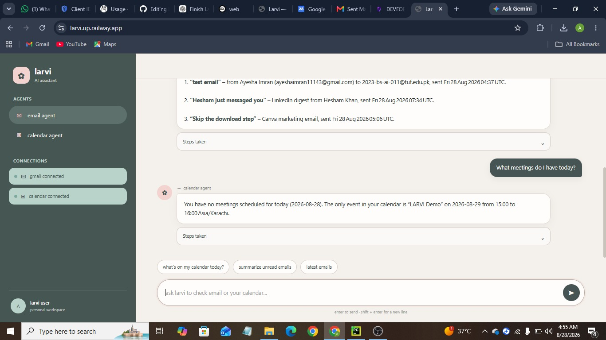

# LARVI — Autonomous Email & Calendar AI Assistant

<p align="center">
  <strong>Your Autonomous Email & Calendar Assistant</strong>
</p>

<p align="center">
  LARVI is an AI-powered personal productivity assistant that connects with Gmail and Google Calendar to understand user requests and perform email and calendar tasks through specialized AI agents.
</p>

## 📸 Screenshots

### LARVI Main Interface


### Email Search


### Calendar


---

## 🚀 Live Demo

**Live Application:**  
https://larvi.up.railway.app/

**GitHub Repository:**  
https://github.com/Ayesha1143/LARVI

---

## 📌 Project Overview

LARVI (Autonomous Email & Calendar Assistant) is an AI-based productivity system designed to help users interact with their Gmail and Google Calendar through natural language.

Instead of manually opening emails, searching through messages, checking schedules, or creating calendar events, the user can simply tell LARVI what they need.

For example:

- "Show me my latest emails."
- "Search my emails for project updates."
- "What's on my calendar today?"
- "Show my upcoming meetings."
- "Summarize my unread emails."

LARVI analyzes the user's request and routes it to the appropriate specialized agent.

The system currently provides two main agents:

- 📧 Email Agent
- 📅 Calendar Agent

A Master Agent manages the overall request handling and determines which specialized agent should process the user's request.

---

## ✨ Key Features

### 📧 Email Management

LARVI can interact with the user's Gmail account and perform email-related operations such as:

- Search emails
- Retrieve recent emails
- Search emails by sender
- Search emails by subject
- Search emails using keywords
- Retrieve unread emails
- Summarize emails
- Extract useful information from emails

The Email Agent is responsible for understanding email-related requests and using the Gmail service to retrieve the required information.

---

### 📅 Calendar Management

LARVI can also interact with Google Calendar.

Calendar-related capabilities include:

- View today's calendar
- Retrieve upcoming events
- Check scheduled meetings
- Retrieve calendar information
- Work with calendar-related requests through natural language

The Calendar Agent handles calendar-specific tasks and communicates with Google Calendar through the configured Google APIs.

---

## 🤖 AI Agent Architecture

LARVI follows a modular multi-agent architecture.

The system contains:

### Master Agent

The Master Agent acts as the central decision-making component.

It receives the user's natural-language request and determines which specialized agent should handle it.

For example:

```text
User Request
     |
     v
Master Agent
     |
     +------------------+
     |                  |
     v                  v
Email Agent       Calendar Agent
     |                  |
     v                  v
Gmail API         Google Calendar API
     |                  |
     +--------+---------+
              |
              v
            Result
              |
              v
             User
```

This architecture makes the system modular and easier to extend with additional agents in the future.

---

## 🔄 Request Workflow

A typical LARVI request follows this process:

```text
User
  |
  v
Frontend Chat Interface
  |
  v
FastAPI Backend
  |
  v
Master Agent
  |
  +--------------------+
  |                    |
  v                    v
Email Agent       Calendar Agent
  |                    |
  v                    v
Gmail Service     Calendar Service
  |                    |
  v                    v
Google APIs
  |
  v
Processed Result
  |
  v
Frontend
```

---

## 🔐 Google OAuth 2.0 Authentication

LARVI uses Google OAuth 2.0 to securely connect a user's Google account.

The authentication flow allows the user to authorize access to the required Gmail and Google Calendar services without sharing their Google password with the application.

The application uses:

- Google OAuth 2.0
- Gmail API
- Google Calendar API

After authentication, the application can use the authorized account to perform the supported email and calendar operations.

### OAuth Flow

```text
User
 |
 v
LARVI
 |
 v
Google OAuth 2.0
 |
 v
User Grants Permission
 |
 v
OAuth Callback
 |
 v
Authenticated Session
 |
 +------------+-------------+
 |                          |
 v                          v
Gmail API              Calendar API
```

---

## 🧠 AI & Backend Technology

LARVI is built using a modern Python-based AI backend.

### Main Technologies

- Python
- FastAPI
- LangChain
- LangGraph
- Ollama Cloud
- Qwen3:8b
- Gmail API
- Google Calendar API
- Google OAuth 2.0
- HTML
- CSS
- JavaScript
- Railway

---

## 🏗️ Technology Stack

| Component | Technology |
|---|---|
| Programming Language | Python |
| Backend Framework | FastAPI |
| Agent Framework | LangChain |
| Workflow | LangGraph |
| AI Model | Qwen3:8b |
| AI Provider | Ollama Cloud |
| Email Integration | Gmail API |
| Calendar Integration | Google Calendar API |
| Authentication | Google OAuth 2.0 |
| Frontend | HTML, CSS, JavaScript |
| Deployment | Railway |
| Version Control | Git & GitHub |

---

## 📁 Project Structure

```text
LARVI/
│
├── app/
│   │
│   ├── agents/
│   │   ├── calendar_agent.py
│   │   ├── email_agent.py
│   │   └── master_agent.py
│   │
│   ├── api/
│   │   ├── auth.py
│   │   └── chat.py
│   │
│   ├── config/
│   │   ├── constants.py
│   │   └── settings.py
│   │
│   ├── graph/
│   │   ├── nodes.py
│   │   ├── state.py
│   │   └── workflow.py
│   │
│   ├── schemas/
│   │   ├── calendar.py
│   │   ├── chat_schema.py
│   │   └── email.py
│   │
│   ├── services/
│   │   ├── calendar_service.py
│   │   ├── gmail_service.py
│   │   └── oauth_service.py
│   │
│   ├── tools/
│   │   ├── calendar_tools.py
│   │   └── email_tools.py
│   │
│   ├── utils/
│   │   ├── error_handler.py
│   │   └── helpers.py
│   │
│   └── main.py
│
├── frontend/
│   ├── css/
│   │   └── style.css
│   │
│   ├── js/
│   │   └── script.js
│   │
│   └── index.html
│
├── screenshots/
│   ├── larvi-main.jpeg
│   ├── email-search.jpeg
│   └── calender.jpeg
│
├── tests/
│   ├── test_agents.py
│   ├── test_calendar_tools.py
│   ├── test_email_tools.py
│   └── test_workflows.py
│
├── .env.example
├── .gitignore
├── Procfile
├── railway.json
├── requirements.txt
└── README.md
```

---

## ⚙️ Installation & Setup

### 1. Clone the Repository

```bash
git clone https://github.com/Ayesha1143/LARVI.git
cd LARVI
```

### 2. Create a Virtual Environment

```bash
python -m venv .venv
```

Activate the environment on Windows:

```bash
.venv\Scripts\activate
```

### 3. Install Dependencies

```bash
pip install -r requirements.txt
```

---

## 🔑 Environment Variables

Create a `.env` file in the project root.

The required configuration includes:

```env
APP_ENV=development
DEBUG=true

GOOGLE_CLIENT_ID=your_google_client_id
GOOGLE_CLIENT_SECRET=your_google_client_secret
GOOGLE_REDIRECT_URI=http://127.0.0.1:8000/auth/callback

OLLAMA_API_KEY=your_ollama_api_key
OLLAMA_MODEL=qwen3:8b

FRONTEND_URL=http://127.0.0.1:8000
```

**Important:** Never upload the `.env` file or API keys to GitHub.

Use `.env.example` as the template for required environment variables.

---

## 🔗 Google Cloud Configuration

To use Gmail and Google Calendar integration, configure a Google Cloud project with:

- Gmail API
- Google Calendar API
- OAuth 2.0 Client
- Authorized redirect URI

For local development:

```text
http://127.0.0.1:8000/auth/callback
```

For the deployed application:

```text
https://larvi.up.railway.app/auth/callback
```

The deployed redirect URI must also be configured in the Google Cloud OAuth client.

---

## ▶️ Running the Application Locally

Start the FastAPI application with:

```bash
uvicorn app.main:app --reload
```

The application will be available at:

```text
http://127.0.0.1:8000
```

Open the URL in your browser and connect the Google account through the OAuth authentication flow.

---

## 💬 Example Requests

After connecting Gmail and Google Calendar, users can interact with LARVI using natural language.

### Email Examples

- Show me my latest emails.
- Search my emails for project updates.
- Summarize my unread emails.

### Calendar Examples

- What's on my calendar today?
- Show me my upcoming meetings.

---

## 🧪 Testing

LARVI includes automated tests for the main components of the system.

Test files include:

- `tests/test_agents.py`
- `tests/test_calendar_tools.py`
- `tests/test_email_tools.py`
- `tests/test_workflows.py`

Tests can be executed using:

```bash
pytest
```

---

## ☁️ Deployment

LARVI is deployed using Railway.

The application uses the GitHub repository as the deployment source.

Railway environment variables are configured separately from the repository to securely store:

- Google Client ID
- Google Client Secret
- Google Redirect URI
- Ollama API Key
- Ollama Model
- Frontend URL
- Application environment settings

### Production URLs

**Application:**  
https://larvi.up.railway.app/

**OAuth Callback:**  
https://larvi.up.railway.app/auth/callback

---

## 🔒 Security

LARVI follows basic security practices for handling authentication credentials and API keys.

- API keys are stored in environment variables.
- `.env` is excluded from Git.
- OAuth is used instead of collecting Google passwords.
- Google access is granted through Google's authorization screen.
- Sensitive credentials are not included in the public repository.

---

## 🎯 Project Objectives

The main objectives of LARVI are:

- Build an autonomous AI productivity assistant.
- Integrate Gmail and Google Calendar.
- Process natural-language user requests.
- Implement specialized AI agents.
- Use LangGraph for agent workflow orchestration.
- Provide a simple conversational frontend.
- Implement secure Google OAuth authentication.
- Deploy the complete application online.

---

## 🔮 Future Enhancements

Possible future improvements include:

- Additional productivity agents
- Email composition and sending
- Calendar event creation and editing
- Meeting reminders
- Task management
- More advanced email summarization
- Voice-based interaction
- Additional Google Workspace integrations
- Personalized user preferences
- More advanced agent routing

---

## 👩‍💻 Author

**Ayesha Imran**

GitHub: https://github.com/Ayesha1143

---

## 📄 License

This project is developed for educational and project demonstration purposes.
